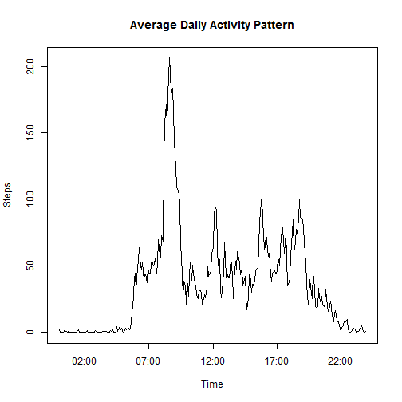

##Loading and preprocessing the data

This section shows how to read the data:


```r
data <- read.csv("activity.csv")
```

##What is the mean total number of steps taken per day?


```r
sums <- aggregate(steps ~ date, data=data, sum)  ##Aggregate ignores NA values
hist(sums$steps, main = "Distribution of Steps Per Day", xlab = "Steps Per Day")
```

 

Below shows the mean and median of the data (ignoring the missing values):


```r
summarydata <- c(Mean = mean(sums$steps), Median = median(sums$steps))
print(summarydata)
```

```
##   Mean Median 
##  10766  10765
```


##What is the average daily activity pattern?

In order to determine the average daily activity pattern, a new data set was created in which the mean number of steps taken per 5 minute interval, averaged across all days.


```r
Avedaily <- aggregate(steps~interval, data = data, mean)
Avedaily$Time<-formatC(Avedaily$interval, width = 4, format = "d", flag = "0")
Avedaily$Time <- strptime(Avedaily$Time, format = "%H%M")
plot(Avedaily$Time, Avedaily$steps, type = "l", ylab = "Steps", xlab = "Time", main = "Average Daily Activity Pattern")
```

 

The 5 minute interval in which the maximum average number of steps taken is calculated below:


```r
Avedaily2 <- Avedaily[order(Avedaily$steps, decreasing = T),]
Avedaily2[1,c(1,2)]
```

```
##     interval steps
## 104      835 206.2
```

##Imputing missing values

The total number of missing values in the dataset is:


```r
sum(!is.na(data$steps))
```

```
## [1] 15264
```

The missing data values will now be filled in with the mean number of steps taken (averaged across all days) for that 5 minute interval.


```r
newdata <- data
newdata$steps <- ifelse(is.na(newdata$steps) == TRUE, Avedaily$steps[Avedaily$interval %in% newdata$interval],newdata$steps)
sums2 <- aggregate(steps ~ date, data=newdata, sum)
hist(sums2$steps, main = "Distribution of Steps Per Day", xlab = "Steps Per Day")
```

 

The mean and median of the new data set is below:


```r
summarydata2 <- c(Mean = mean(sums2$steps), Median = median(sums2$steps))
print(summarydata2)
```

```
##   Mean Median 
##  10766  10766
```

The impact, when filling in the missing values with the mean of the 5 minute interval, averaged across all days, is minimal on the median and has no effect on the mean.

##Are there differences in activity patterns between weekdays and weekends?

Load the ggplot2 and scales


```r
library(ggplot2)
library(scales)
```

Using the new dataset created by filling in the missing values,


```r
newdata$date <- as.Date(newdata$date)
newdata$Day <- weekdays(newdata$date)
newdata$dayType <- factor(ifelse(newdata$Day %in% c("Saturday","Sunday"), "Weekend","Weekday"))
Avedaily2 <- aggregate(steps~interval+dayType, data = newdata, mean)
Avedaily2$Time<-formatC(Avedaily2$interval, width = 4, format = "d", flag = "0")
Avedaily2$Time <- strptime(Avedaily2$Time, format = "%H%M")
g <- ggplot(Avedaily2, aes(Time, steps))+geom_line()+facet_grid(dayType~.)+scale_x_datetime(labels = date_format("%H:%M"))
print(g)
```

 
